# World Trade and GDP
*Analyzing if the the trend increased trade has had an effect on global GDP.* 

**Global Trade is Nothing New**
* The Silk Road connected China and Europe from about 200 BC to 1500 AD, with about a two year round-trip. (refs 1, 2)
* Today a flight from Beijing to Rome is about 14 hours with one stop.
* Is there a connection between trade and economic growth?
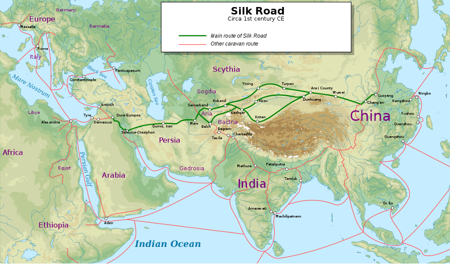*Source: "Silk Road" - Wikipedia

**Trade has been Increasing**
* Trade was 22 times higher in 2000 than 1950. (ref 3)
* Encouraged by General Agreement on Tariffs and Trade (GATT) in 1948. (ref 3)
* GATT led to the World Trade Organization in 1995. (ref 3)
* Over 200 trade agreements worldwide. (ref 4)
* Reduction of tariffs worldwide.

**Trade Views**
* Most economists likely to be in favor of free trade because of the net benefits.
* Creates opportunities for growth throughout the world (eg China).
* There are risks like equity distribution. (ref 6)
* Has increased trade affected the world GDP growth?
* Is every country better off or are there clear winners?

**World Trade and GDP Today**
* GDP per capita has grown enormously since the 1960s from less than 1,000 USD per person to over 10,000 USD in current USD.  Trade, as measure by the percent of world GDP from imports and exports, has also greatly increased during that time.
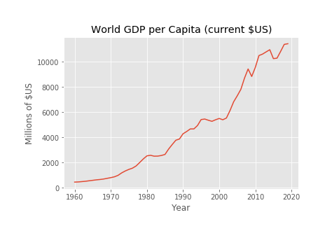

* Half of total world GDP is currently concentrated in five countries: the US, China, Japan, Germnay, and India.  Current levels of trade are also shown by regions, with North America having some of the lowest trade as a percent of regional GDP and the Middle East and North Africa being near the top.
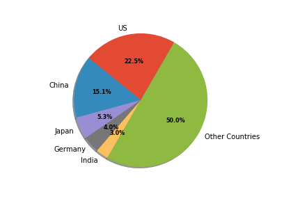
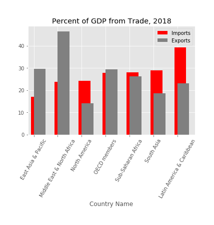

**GDP Growth**
* GDP growth rates for the highest GDP countries are shown below. India and China have rates consistently above the world average while the US, Japan, and Germany are right around or below the average for this time period.
* However, the regions that experienced the greatest gain in GDP growth as measured by totals in 2019 and 1968 (the first year of widely available GDP data), OECD countries (Europe) were the clear winners, with East Asia and the Pacific (which include China and Japan), and North America showing significant gains over other regions in the world.
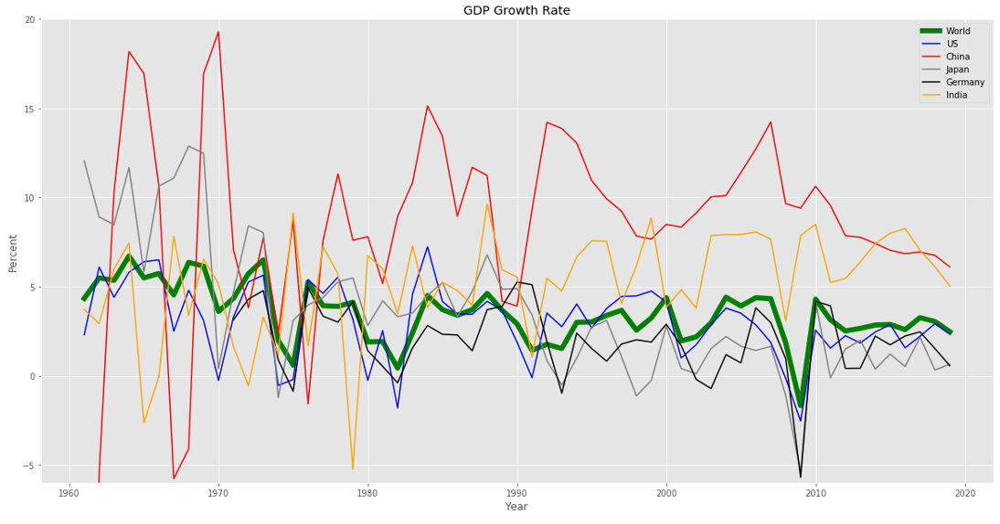
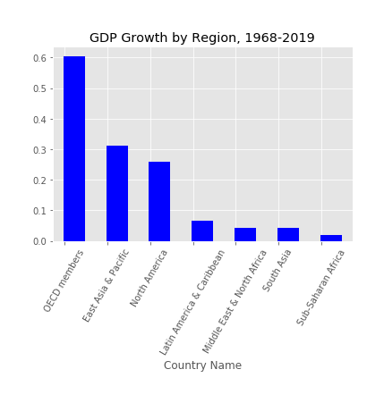

**Trade Growth Rates**
* Trade growth rates, depicted by growth in exports and imports as a percent of regional GDP, show all regions of the world have increased trade since the 1960s.
* Large increases can be seen starting around the year 2000, which is in the early years of the WTO with the biggest impact being China becoming a member country, breaking down trade barriers between it and the rest of the globe.
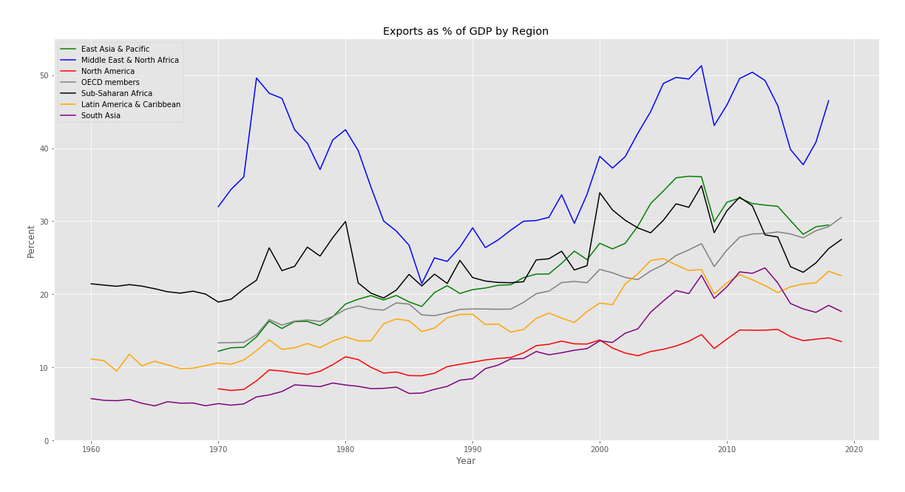
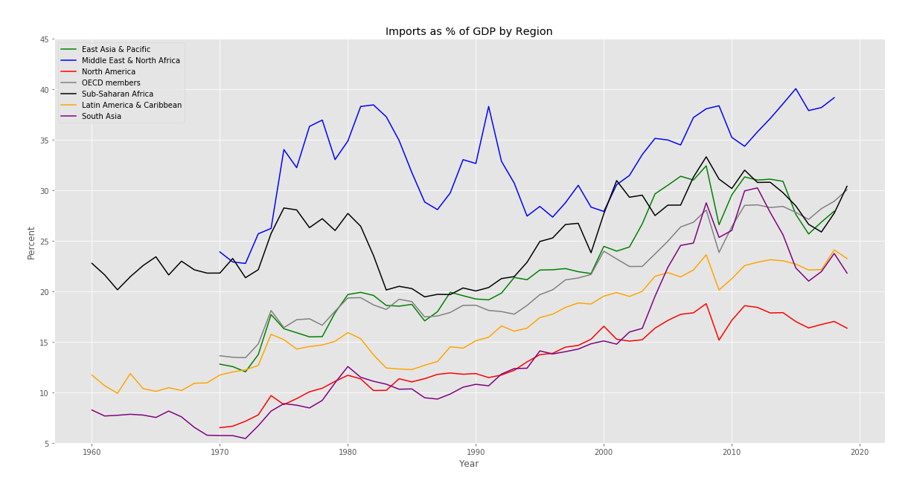

**Trade vs GDP Growth**
* Trade growth rates for all countries and their GDP growth rates are plotted below.  Most countries are clustered between 0-50 percent trade growth with a handful of outliers.
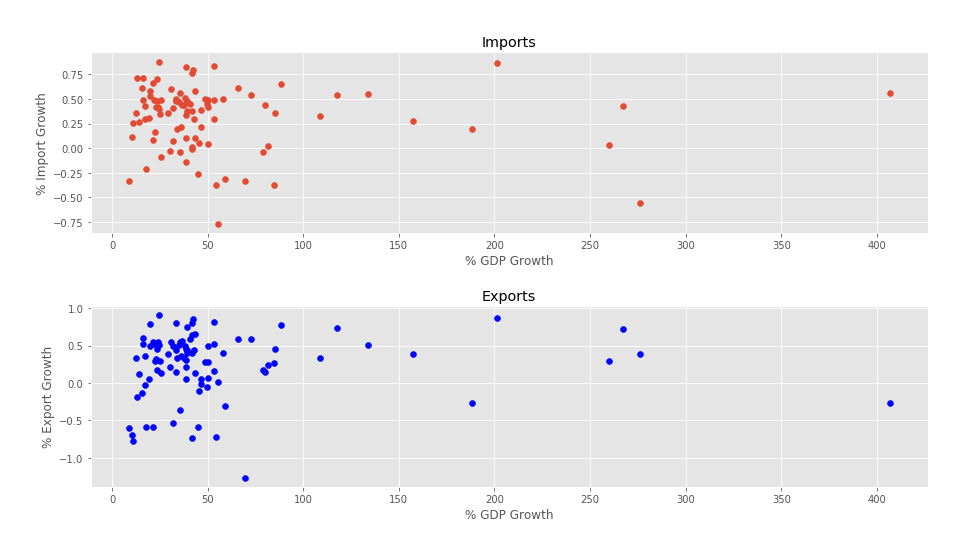

**OLS Regression for Imports and Exports**
* The ordinary least squares linear regression did not appear to show much of a correlation between import and export growth and GDP growth. 
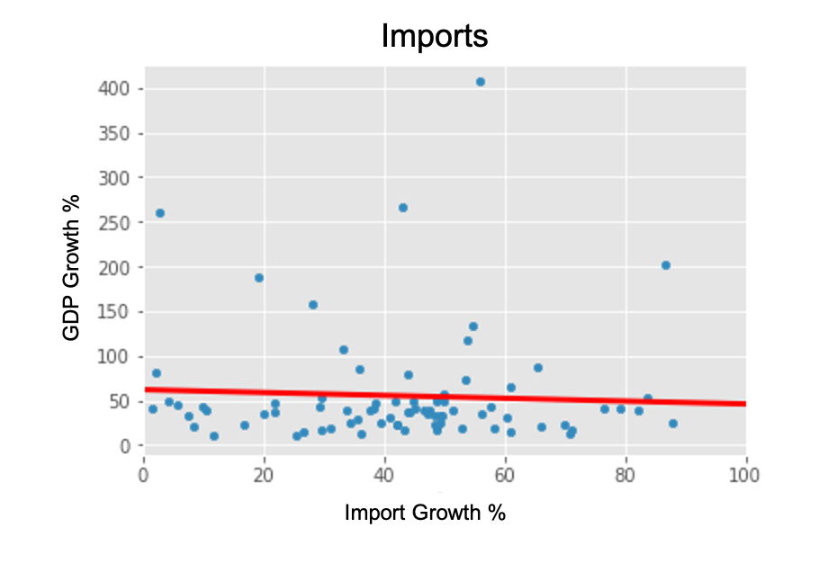
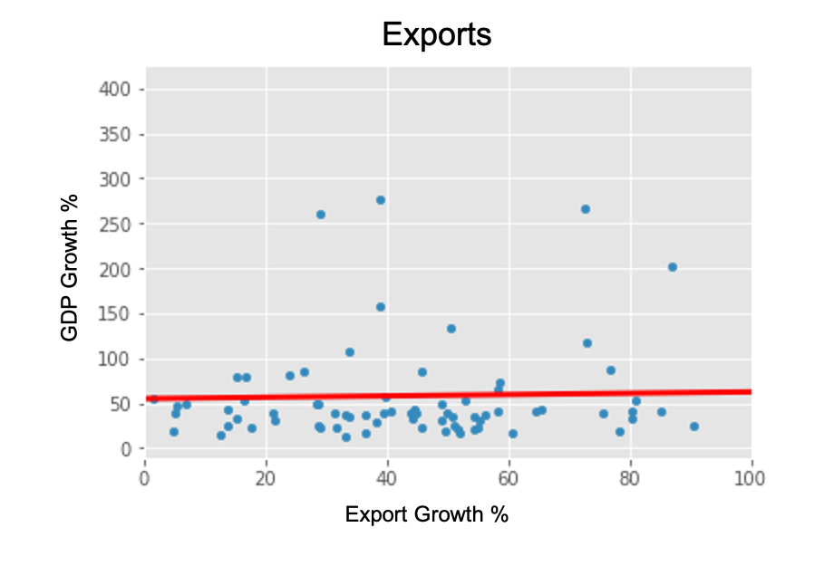

* To see if this was caused by outliers, countries whose GDP was more than 125 times their 1968 levels were removed.
* Outliers dropped: Botswana, China, Indonesia, Oman, Republic of Korea, Saudi Arabia, and Singapore.
* There is still not a clear correlation between trade growth and GDP growth:
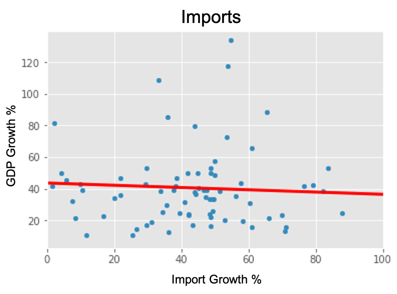
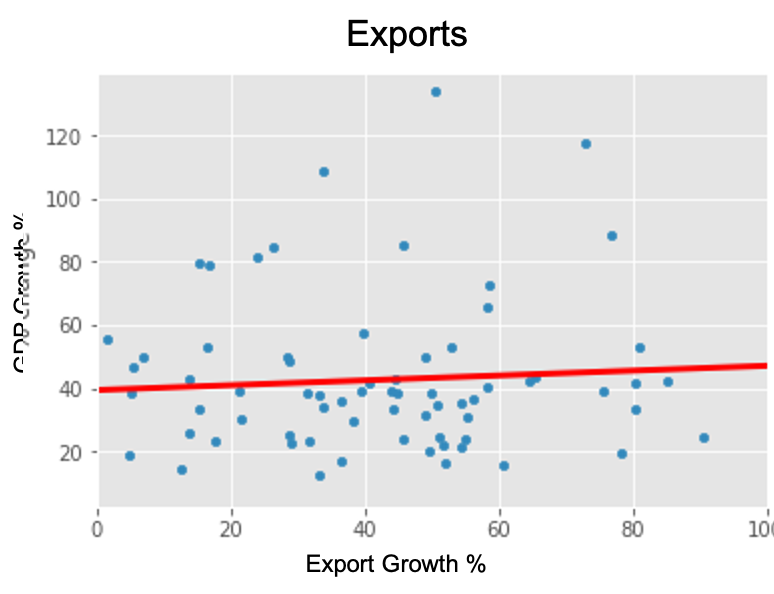

**Conclusions**
* Trade growth does not appear to be a significant driver of GDP growth throughout the majority of the world.
* GDP distribution has been uneven, being highly concentrated in the US, China, and Europe.
* Effects of trade likely not proportional to the growth in trade. 
* Overall, there has been worldwide economic growth, including a large reduction in poverty with this reduction largely due to growth of China and India. (ref 7)

**Further Research**
* Why haven’t high trading regions experience significant growth?  Possibly due to quality of government and institutions and real trade revenues.
* How will COVID affect countries with high trade as percent of GDP?  Concerns for countries like Vietnam where approximately 99 percent of GDP is from exports. (ref 8)
* Is protectionism on the rise?  If so, will it make much of a difference in economic growth?
* What are the intra-country costs and benefits of opening up to trade?

**References**
<ul>1. “Silk Road.” History, A&E Television Networks, 26 September 2019, https://www.history.com/topics/ancient-middle-east/silk-road. 
    2. “A Silk Road Caravan.” The Globalist, The Globalist, Washington, D.C., 1 January 2001, https://www.theglobalist.com/a-silk-road-caravan.
  3. Pepelasis, Adamantios A., et al. “Tariff.” Encyclopedia Britannica, Encyclopedia Britannica, Inc, 13 November 2019, https://www.britannica.com/topic/tariff/.
  4. Feenstra, Robert C. and Alan M. Taylor. Essentials of International Economics. New York, NY: Worth Publishers, 2014.
  5. Bown, Chad P. and Douglas A. Irwin.  “The GATT’s Starting Point: Tariff Levels Circa 1947.” National Bureau of Economic Research, Working Paper 21782, December 2015, http://www.nber.org/papers/w21782.
  6. Kuepper, Justin. “The Impact of Globalization on Economic Growth.” The Balance, 4 April 2020, https://www.thebalance.com/globalization-and-its-impact-on-economic-growth-1978843.
  7. Ferreira, Francisco H.G. and Martin Ravallion. “Global Poverty and Inequality: A Review of the Evidence.” World Bank Development Research Group, Policy Research Working Paper 4623, May 2008.
  8. Vanham, Peter. “The Story of Viet Nam’s Economic Miracle.” World Economic Forum, 11 September 2018, https://www.weforum.org/agenda/2018/09/how-Vietnam-became-an-economic-miracle/.
<\ul>

